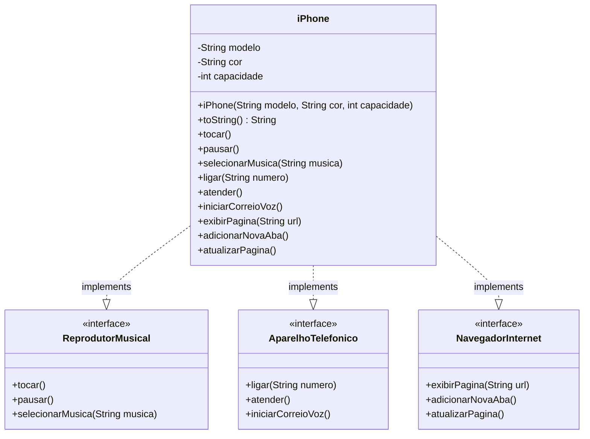

# 📱 Sistema iPhone com Programação Orientada a Interfaces

Este repositório contém a minha solução para o desafio proposto na trilha de Java da DIO, focado na modelagem de um componente iPhone utilizando conceitos de POO como interfaces e encapsulamento.

📒 Sobre o Desafio | ⚙️ Funcionalidades Implementadas | 🏗️ Estrutura do Código | 📚 Aprendizados

Modelagem e implementação de um iPhone multifuncional com Java e UML! 🚀

## 📒 Sobre o Desafio

O objetivo deste desafio foi representar as funcionalidades de um iPhone utilizando conceitos de orientação a objetos, com destaque para a programação voltada a interfaces.

A proposta incluía:

* Criar interfaces para representar as funcionalidades de:

   * Reprodutor Musical
   * Aparelho Telefônico
   * Navegador de Internet
* Implementar uma classe `iPhone` que integra essas funcionalidades.
* Representar a modelagem utilizando diagrama UML.

## ⚙️ Funcionalidades Implementadas

* Interface `ReprodutorMusical`: tocar, pausar e selecionar músicas.
* Interface `AparelhoTelefonico`: ligar, atender e iniciar correio de voz.
* Interface `NavegadorInternet`: exibir páginas, adicionar abas e atualizar.
* Classe `iPhone` que implementa todas as funcionalidades das interfaces.
* Testes básicos demonstrando o funcionamento da classe.

## 🏗️ Estrutura do Código

O sistema está dividido da seguinte forma:

```
src/
        └── br/com/dio/iphone/
            ├── interfaces/         # Interfaces das funcionalidades
            │   ├── ReprodutorMusical.java
            │   ├── AparelhoTelefonico.java
            │   └── NavegadorInternet.java
            ├── model/              # Implementação da classe Iphone
            │   └── Iphone.java
            └── app/                # Classe principal para testes
                └── Main.java
```

## 📊 Diagrama UML (Mermaid)



## 📚 Aprendizados

Com esse projeto, eu aprofundei os seguintes conceitos de programação orientada a objetos:

✔️ Programação orientada a interfaces;
✔️ Encapsulamento com atributos privados e uso de construtor;
✔️ Organização de código em pacotes e separação de responsabilidades;
✔️ Prática com modelagem UML utilizando o Mermaid para visualização;
✔️ Aplicação prática de métodos com retorno e parâmetros em Java.

Fiquei muito satisfeito com o resultado, pois consegui aplicar de forma clara os princípios da POO e estruturar um projeto funcional, organizado e fácil de expandir no futuro.