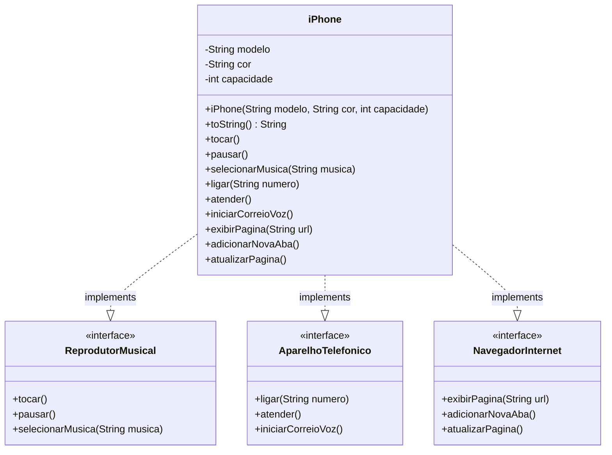

# 📱 Desafio de Modelagem - iPhone

## Descrição do Desafio

Este projeto é uma solução para o desafio de modelagem e diagramação de um componente iPhone da trilha de Java da DIO.
O objetivo foi criar uma representação UML do iPhone, abrangendo suas funcionalidades como Reprodutor Musical, Aparelho
Telefônico e Navegador na Internet,
e implementar as classes e interfaces correspondentes em Java.

## 📊 Diagrama UML

O diagrama abaixo representa a modelagem das classes e interfaces do componente iPhone:



## 📂 Estrutura do Projeto
```plaintext
src/
└── br.com.dio.iphone/
├── interfaces/       # Contratos das funcionalidades
│   ├── ReprodutorMusical.java
│   ├── AparelhoTelefonico.java
│   └── NavegadorInternet.java
├── model/           # Implementação
│   └── Iphone.java
└── app/             # Testes
└── Principal.java
```

## 🛠️ Implementação

### Interfaces

#### ReprodutorMusical

```java
package br.com.dio.iphone.model.interfaces;

public interface ReprodutorMusical {
   void tocar();

   void pausar();

   void selecionarMusica(String musica);
}
```

#### AparelhoTelefonico

```java
package br.com.dio.iphone.model.interfaces;

public interface AparelhoTelefonico {
   void ligar(String numero);

   void atender();

   void iniciarCorreioVoz();
}
```

#### NavegadorInternet

```java
package br.com.dio.iphone.model.interfaces;

public interface NavegadorInternet {
   void exibirPagina(String url);

   void adicionarNovaAba();

   void atualizarPagina();
}
```

### Classe iPhone

```java
package br.com.dio.iphone.model;

import br.com.dio.iphone.model.interfaces.AparelhoTelefonico;
import br.com.dio.iphone.model.interfaces.NavegadorInternet;
import br.com.dio.iphone.model.interfaces.ReprodutorMusical;

public class Iphone implements ReprodutorMusical, AparelhoTelefonico, NavegadorInternet {
   private String modelo;
   private String cor;
   private int capacidade;

   public Iphone(String modelo, String cor, int capacidade) {
      this.modelo = modelo;
      this.cor = cor;
      this.capacidade = capacidade;
   }

   @Override
   public String toString() {
      return "Iphone - " + "modelo: " + modelo + " cor: " + cor +
              " capacidade: " + capacidade;
   }

   @Override
   public void tocar() {
      System.out.println("Tocando música");
   }

   @Override
   public void pausar() {
      System.out.println("Pausando música");
   }

   @Override
   public void selecionarMusica(String musica) {
      System.out.println("Música selecionada: " + musica);
   }

   @Override
   public void ligar(String numero) {
      System.out.println("Ligando para o número: " + numero);
   }

   @Override
   public void atender() {
      System.out.println("Atendendo a ligação");
   }

   @Override
   public void iniciarCorreioVoz() {
      System.out.println("Iniciando o correio de voz");
   }

   @Override
   public void exibirPagina(String url) {
      System.out.println("Página: " + url);
   }

   @Override
   public void adicionarNovaAba() {
      System.out.println("Adicionar nova aba");
   }

   @Override
   public void atualizarPagina() {
      System.out.println("Atualizar página");
   }
}
```

## Sobre a Solução

A solução adota o princípio de programação orientada a interfaces, onde:

1. Foram definidas três interfaces que representam as diferentes funcionalidades do iPhone:
    - `ReprodutorMusical`: Para as funcionalidades de reprodução de música
    - `AparelhoTelefonico`: Para as funcionalidades de telefonia
    - `NavegadorInternet`: Para as funcionalidades de navegação na web

2. A classe `Iphone` implementa todas as três interfaces, garantindo que o dispositivo tenha todos os comportamentos
   necessários.

3. Cada método implementa uma funcionalidade básica com saídas simples para demonstrar o conceito.

Esta abordagem permite que o código seja facilmente extensível e manutenível, seguindo os princípios de design orientado
a objetos.

## Tecnologias Utilizadas

- Java
- UML (Unified Modeling Language)

## Como Executar

Para testar a implementação, você pode criar uma classe principal com o método `main` e instanciar um objeto da classe
`Iphone`:

```java
package br.com.dio.iphone;

import br.com.dio.iphone.model.Iphone;

public class Main {
   public static void main(String[] args) {
      Iphone iphone = new Iphone("iPhone 15", "Preto", 256);

      System.out.println(iphone);

      // Testando funcionalidades de Reprodutor Musical
      iphone.tocar();
      iphone.pausar();
      iphone.selecionarMusica("Bohemian Rhapsody");

      // Testando funcionalidades de Aparelho Telefônico
      iphone.ligar("123-456-789");
      iphone.atender();
      iphone.iniciarCorreioVoz();

      // Testando funcionalidades de Navegador na Internet
      iphone.exibirPagina("https://www.dio.me");
      iphone.adicionarNovaAba();
      iphone.atualizarPagina();
   }
}
```